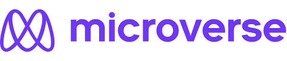

<!--
HOW TO USE:
This is an example of how you may give instructions on setting up your project locally.

Modify this file to match your project and remove sections that don't apply.

REQUIRED SECTIONS:
- Table of Contents
- About the Project
  - Built With
  - Live Demo
- Getting Started
- Authors
- Future Features
- Contributing
- Show your support
- Acknowledgements
- License

After you're finished please remove all the comments and instructions!
-->

  <!-- You are encouraged to replace this logo with your own! Otherwise you can also remove it. -->
  
   

  <h3><b>Microverse README Template</b></h3>

<!-- TABLE OF CONTENTS -->

# 📗 Table of Contents

- [📖 About the Project](#about-project)
  - [🛠 Built With](#built-with)
    - [Tech Stack](#tech-stack)
    - [Key Features](#key-features)
  - [🚀 Live Demo](#live-demo)
- [💻 Getting Started](#getting-started)
  - [Setup](#setup)
  - [Prerequisites](#prerequisites)
  - [Install](#install)
  - [Usage](#usage)
  - [Run tests](#run-tests)
  - [Deployment](#triangular_flag_on_post-deployment)
- [👥 Authors](#authors)
- [🔭 Future Features](#future-features)
- [🤝 Contributing](#contributing)
- [⭐️ Show your support](#support)
- [🙏 Acknowledgements](#acknowledgements)
- [❓ FAQ](#faq)
- [📝 License](#license)

<!-- PROJECT DESCRIPTION -->

# 📖 [awesomebooks] 

>

**[awesomebooks]** This is a todo-list website, where you can track your every day tasks.

## 🛠 Built With <a name="built-with">HTML, CSS, javascript and webpack for bundling.</a>

### Tech Stack 

> Tech stack
> I have used vanilla js, webpack and HTML

  
Client

  <ul>
    <li><a href="https://css.org/">CSS</a></li>
  </ul>

  
Interactivity

  <ul>
    <li><a href="https://js.com/">vanilla js</a></li>
  </ul>

<!-- Features -->

### Key Features 

- **[allows_task_registration]**
- **[performs_Delete_operation]**

(<a href="#readme-top">back to top</a>)

(<a href="#readme-top">back to top</a>)

<!-- GETTING STARTED -->

## 💻 Getting Started 

To get a local copy up and running, follow these steps.

### Prerequisites

In order to run this project you need:
- open index.html and open it inside your favorite browser.

### Setup

- Create a local directory that you want to clone the repository.

- Open the git-bash in the current created directory.

- Clone this repository

- Open git-bash inside the cloned repository

- run npm install

- after installation has finished you can open index.html

- That's it enjoy :)

### Install

Install this project with:

install the dependancies using yarn.

### Usage

(<a href="#readme-top">back to top</a>)

<!-- AUTHORS -->

## 👥 Authors 

👤 **Ibrahim**

- GitHub: [@githubhandle](https://github.com/ibranista)
- Twitter: [@twitterhandle](https://twitter.com/ibrahimkedir9)
- LinkedIn: [LinkedIn](https://linkedin.com/in/ibraheem88)

(<a href="#readme-top">back to top</a>)

<!-- FUTURE FEATURES -->

## 🔭 Future Features 

> Describe 1 - 3 features you will add to the project.

- [ user authorization and authentication ] **[new_feature_1]**
- [ add option to arrange tasks based on date] **[new_feature_2]**
- [ add an option to edit tasks that are added by mistake] **[new_feature_3]**

(<a href="#readme-top">back to top</a>)

<!-- CONTRIBUTING -->

## 🤝 Contributing 

Contributions, issues, and feature requests are welcome!

Feel free to check the [issues page](../../issues/).

(<a href="#readme-top">back to top</a>)

<!-- SUPPORT -->

## ⭐️ Show your support 

> support me by giving this project a star

(<a href="#readme-top">back to top</a>)

<!-- ACKNOWLEDGEMENTS -->

## 🙏 Acknowledgments 

> I would like to thank Kazaneza for helping me understand webpack.

(<a href="#readme-top">back to top</a>)

<!-- FAQ (optional) -->

## ❓ FAQ 

> Add at least 2 questions new developers would ask when they decide to use your project.

- **[fill free to use this project in any way that's legal.]**

(<a href="#readme-top">back to top</a>)

<!-- LICENSE -->

## 📝 License 

This project is [MIT]("https://opensource.org/licenses/MIT") licensed.

_NOTE: we recommend using the [MIT license](https://choosealicense.com/licenses/mit/) - you can set it up quickly by [using templates available on GitHub](https://docs.github.com/en/communities/setting-up-your-project-for-healthy-contributions/adding-a-license-to-a-repository). You can also use [any other license](https://choosealicense.com/licenses/) if you wish._

(<a href="#readme-top">back to top</a>)

